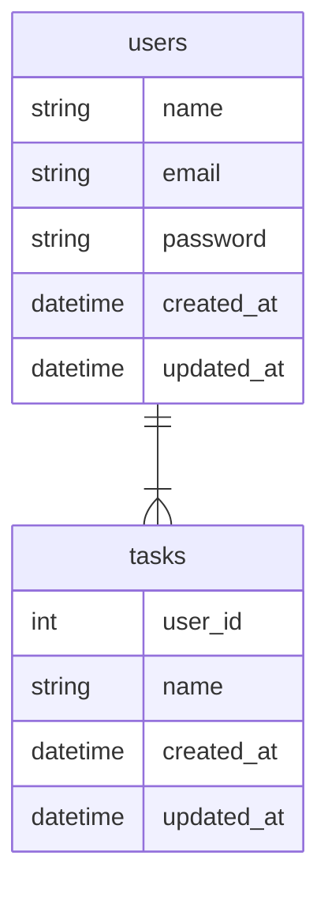

# 勉強会用のLaravelデモコード

## 環境構築手順
1. コンテナを起動する<br>
注意：各プロセスのウェルノウンポートを使用しているので、ポートの重複に注意してください。
```
docker compose up -d --build
```

2. 依存パッケージのインストール
```
docker compose exec app bash
composer install
```

3. マイグレーションを実行し、各テーブルを作成する
```
APP_ENV=testing php artisan migrate
```

4. テストフォルダを作成する（unitテストのみのため）
```
mkdir /var/www/src/tests/Featuer
```

5. パーミッションの設定
```
chmod -R 777 .
```

6. テスト実施
```
php artisan test
```

## ER図
注意：mermaidを使用しているため、mermaidがプレビューでできる環境で表示してください。

